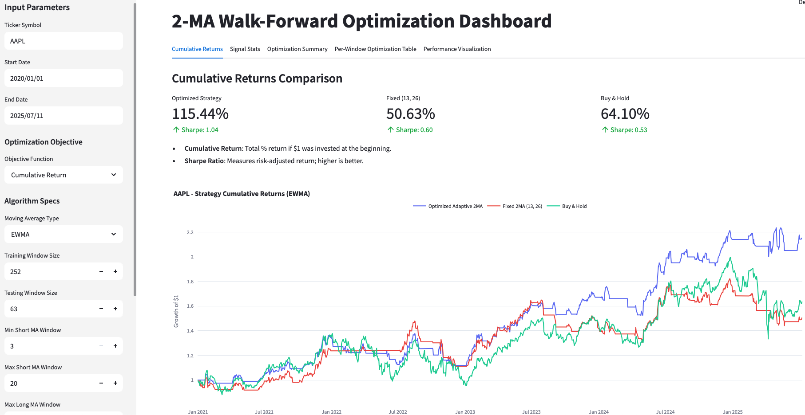
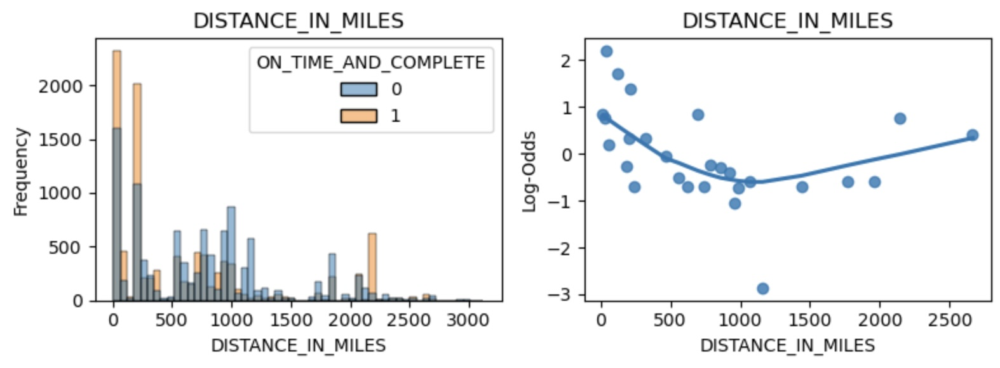
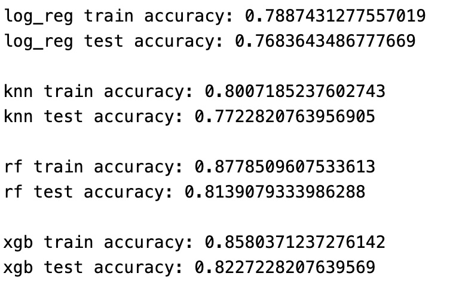
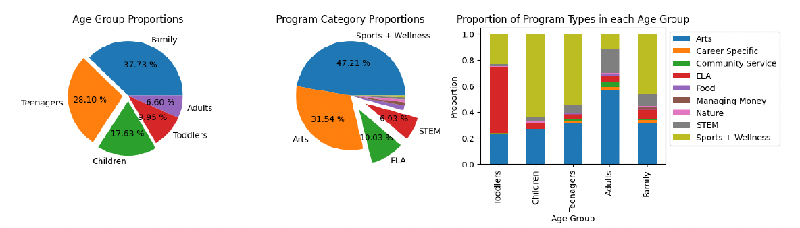
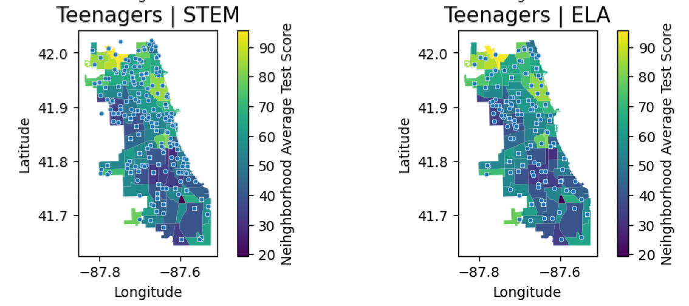

#### Languages: Python, SQL, R
#### BI Tools: Tableau, Excel

## Education
B.A., Statistics & Data Science (_Double Major_)

Northwestern University (_Class of 2027_) 

3.94/4.00

### Relevant Coursework:
Data Science courses:
- STAT 303-1,-2,-3: Data Science with Python - basic data analysis tools, bias/variance analysis, and ML algorithms such as regressions, tree-based methods, gradient boosted trees, stacking
- STAT 305: Information Management - SQL and Python based database management, relational databases
- STAT 201: Programming for Data Science - coding in Python and R, basic data structures and algorithms
- STAT 302: Data Visualization (planned for Fall 2025) 

Statistics courses:
- STAT 320-1,-2,-3: Statistical Theories and Methods - probability, distributions, inference, likelihood ratio tests, regression, analysis of variance (ANOVA)
- STAT 202: Statistics for Data Science - statistical inference and basic data visualization in R
- STAT 350: Regression Analysis (planned for Fall 2025) 
- STAT 348: Multivariate Analysis (planned for Fall 2025)

Mathematics courses:
- MATH 230: Multivariable Calculus (Calc III) 
- STAT 228: Series and Multiple Integrals 
- MATH 240: Linear Algebra

## Work Experience
**Northrop Grumman | Business Analyst Intern | _June 2025 - Present_**
- Analyzed cost data across 3 high-value government contracts, identifying variances and uncovering drivers of budget overruns while forecasting final project expenses using historical trends, and supporting financial stability and commitment to budget targets through improved cost control.
- Conducted thorough audits of multiple government programs to ensure accurate cost structures and adherence to budget allocations, utilizing advanced MS Excel (queries, pivot tables, macros) and SAP skills to effectively support data-driven decision-making over the course of 3 months.

**Taro AI | Data Science Intern | _June 2024 - September 2024_**
- Collaborated with startup founders to design a machine learning pipeline for tree species prediction across 17 classes, aligning model structure and evaluation strategies with product development goals to accelerate development of AI-driven computer vision tree inventory application.
- Presented findings and model evaluations to leadership, translating complex technical results into business-focused recommendations to support product strategy, while balancing the model’s accuracy as well as its cost-effectiveness and scalability.

## Certifications

**DeepLearning.AI's Neural Networks and Deep Learning Coursera Certificate** | _July 2025_

**DeepLearning.AI's Improving Deep Neural Networks: Hyperparameter Tuning, Regularization, and Optimization** | _July 2025_

## Projects

### Adaptive Moving Average Strategy Optimization Dashboard *(in progress)*
#### June 2025 - Present
This project stems from my personal interest in financial markets and quantitative trading. A common buy/sell signal in financial markets is the dual-moving average crossover. In this project, I designed a constrained optimization algorithm in Python using walk-forward backtesting and Optuna-based hyperparameter optimization to efficiently tune the values of the short-term and long-term MAs $(w_{short}, w_{long})$ while avoiding data leakage and overfitting. 

I implemented a fully-customizable, user-friendly Streamlit dashboard to run the algorithm and visualize the results of the optimizer in a centralized online website. The tool supports both simple and exponentially weighted moving averages, allows for short-selling, and visualizes cumulative returns, trading signals, and window-specific performance metrics. It also introduces custom performance diagnostics, such as a Signal vs. Return Confusion Matrix, to assess the strategy’s ability to correctly predict market direction under both long and short positions.

The algorithm has varying results on different securities. So far, I have achieved a **96% increase in Sharpe ratio** (risk-adjusted return) and an **80% increase in cumulative return** above the baseline buy-and-hold strategy on AAPL during the period of 01/01/2020 to the present day. However, its performance is much less optimistic on many other securities. 

This project is **in progress**, and I am currently working on generalizing the algorithm to several securities by continuing to refine its logic and running hundreds of trials to analyze its performance on different securities. I plan on identifying which factors associated with a security contribute to the algorithm's success or lack thereof in uncovering its signal and generating profit. I also plan on implementing other hyperparameters (e.g. the type of moving average, shorting logic, etc.) into the optimization to further improve performance. 

Tools/Skills: 
- Python (pandas, numpy, plotly)
- Optuna
- Streamlit
- Financial data
- Time series analysis

### Product Delivery Prediction: STAT 303-3 Final Project
#### March - June 2025

ML binary classification project predicting whether a product delivery is on time and completed. Built a stacking model combining Logistic Regression, KNN, Random Forest, and XGBoost classifiers using a Logistic Regression metamodel to obtain 82.27% test accuracy. I performed exploratory data analysis and conducted feature engineering to improve performance by visualizing approximate-log-odds against each predictor (example shown below). 

I experimented with different hyperparameter tuning frameworks such as Grid Searches, Random Searches, Bayesian searches, and Optuna for each of the base learners and the final metamodel. I built a unified pipeline using sklearn to write efficient and clear code that extracts and transforms the data for each base learner, and passes it through the model to obtain results. 

[Link: Product Delivery Prediction (Report + Python code)](STAT_303_3_Order_Delivery_Prediction/Order_Delivery_Prediction.html)

Tools/Skills:
- Python (Scikit-learn, XGBoost, Pandas, Numpy, Seaborn)
- Hyperparameter tuning
- Stacking ML models

### Geospatial Equity Data Analysis in Chicago Youth Programs
#### November - December 2024 
I completed this project with 3 of my peers during a Data Science Course at Northwestern, STAT 303-1: Data Science I with Python. 

We aimed to determine the relationship between levels of equity in Chicago youth programs for elementary, middle, and high school students and various socio-economic features. We used the My CHI My Future dataset, which includes over 200,000 programs and 40 features. The analysis includes statistical testing, geospatial data visualization, and exploratory data analysis (EDA) to support our findings. 

[Link: Chicago Geospatial Equity Analysts (PDF Report)](Chicago_Programs_Equity_Project/STAT3031_Final_Report.pdf) 

[Link: Chicago Geospatial Equity Analysts (Python Code)](Chicago_Programs_Equity_Project/Team_3_Project_Code.html)

Tools/Skills: 
- Python (pandas, numpy) 
- Statistical analysis
- Data cleaning
- Geospatial analysis & plotting (geopandas, folium)
- Data visualization (matplotlib, seaborn)
  
### Species Classification Model
#### June 2024 - September 2024
This project was completed during my time working at TaroAI as a Data Science Intern. 

My goal for this project was to develop a multiclass classification machine learning model in Python to successfully predict the species of trees based on ground-level images. I used various approaches to solve this computer vision predicions problem and worked across various different datasets provided to me by the company. I achieved ~85% accuracy in the most successful approach, using logistic regression with DINOv2 for feature extraction. 

Tools/Skills:
- Python (python, numpy)
- Feature extraction (DINOv2)
- Machine Learning
- Computer Vision
- Data cleaning
- Model evaluation
- Multi-class classification
- Large language models
- APIs

### Survey Data Analysis
#### November 2023 - December 2023
I completed this project as a final exam for one of my DS classes at Northwestern. 

I worked with a large dataset of over 1000 student responses and extracted useful insights relating to student social behavior. Using various statistical methods and analysesl I validated my results and created visualizations to display my work. I worked with two other peers and collaborated using R. 

[Link: Survey_Data_Analysis (Report + R code)](survey_data_analysis_project/survey_data_analysis.html)

Tools/Skills:
- R
- Data analysis
- Data wrangling
- Data visualization
- Regression analysis
- Hypothesis testing
- Exploratory data analysis (EDA)

