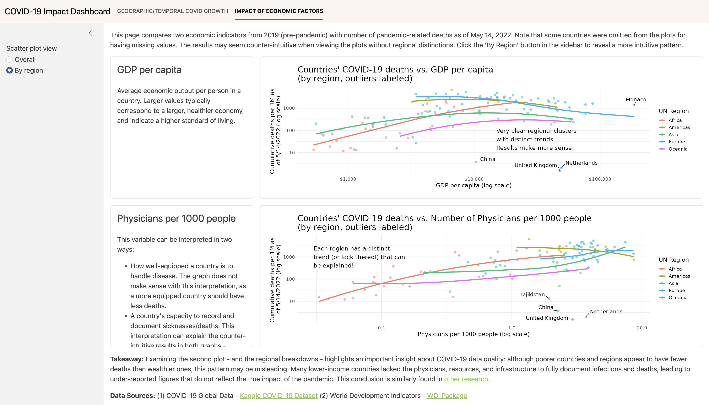

#### Languages: Python, SQL, R

# Education

Northwestern University (_Class of 2027_) 

Bachelor's Degree, Statistics & Data Science (_Double Major_)

Kellogg Certificate Program for Undergraduates in Financial Economics

Cumulative GPA: 3.96/4.00

### Relevant Coursework:
Data Science courses:
- STAT 362: Advanced Machine Learning
- STAT 304: Data Structures and Algorithms
- STAT 303-1,-2,-3: Data Science with Python
- STAT 305: Information Management
- STAT 302: Data Visualization

Statistics courses:
- STAT 320-1,-2,-3: Statistical Theories and Methods
- STAT 350: Regression Analysis 
- STAT 348: Multivariate Analysis
- STAT 354: Time Series Modeling

Mathematics courses:
- MATH 230: Multivariable Calculus
- STAT 228: Series and Multiple Integrals 
- MATH 240: Linear Algebra
- MATH 366: Mathematical Models in Finance

Economics & Finance courses: 
- ECON 310: Microeconomics
- ECON 311: Macroeconomics
- KELLG_FE 310: Finance I

# Work Experience

**The Jordan Company | Data Analyst Intern | _June 2026 - August 2026_**
- Conducted financial and quantitative data analysis to support strategic operational initiatives across 4 portfolio companies in the power, industrials, healthcare, and consumer verticals, synthesizing complex datasets to generate insights and inform business and investment decision-making.
- Developed and evaluated 2 Claude-based AI workflows to automate and standardize both recurring due diligence analysis and executive summary generation, incorporating user-provided data inputs in varied formats and reusable scripts to produce structured deliverables for executive leadership.
- Evaluated LLM capabilities for enterprise dashboard development by building 2 end-to-end dashboard prototypes with AI-generated frontend and backend components and authoring an implementation guide outlining appropriate use cases and limitations for future users. 

**Northrop Grumman | Business Analyst Intern | _June 2025 - August 2025_**
- Analyzed cost data across 4 government programs valued at $100M+ to identify cyclical trends, key cost drivers, and root causes of cost overruns.
- Forecasted program-level expenditures with run-rate models, using historical data to predict future variances and improve financial planning.
- Developed and tested an automated internal reporting tool using VBA macros to clean and reformat cost data in Excel, streamlining report distribution among program team members and reducing program managers’ processing time by 70%, enabling faster and more informed decision making.

**Taro AI | Data Scientist Intern | _June 2024 - September 2024_**
- Engineered a multi-class tree species classification machine learning pipeline in Python, integrating Meta’s DINOv2 vision transformer for robust feature extraction and applying logistic regression to achieve 85% accuracy across multiple geographically diverse tree image datasets.
- Performed comparative analysis of 3 large language models (LLMs) for image-based tree species classification, assessing accuracy, precision, recall, and F1 metrics, while implementing cross-validation and hyperparameter tuning to enhance generalization performance and reduce model overfitting.
- Presented quantitative findings to leadership, translating complex model evaluations into business recommendations to support product strategy.

# Certifications

**DeepLearning.AI's Neural Networks and Deep Learning Coursera Certificate** | _July 2025_ | [Credential here](https://www.coursera.org/account/accomplishments/verify/420U3B3MGZP1)

**DeepLearning.AI's Improving Deep Neural Networks: Hyperparameter Tuning, Regularization, and Optimization** | _July 2025_ | [Credential here](https://www.coursera.org/account/accomplishments/verify/ZGE5DBT0VE6U)

# Machine Learning Projects

## Multivariate LSTM Forecasting of Sector ETFs with News Sentiment Features
#### November 2025 - December 2025

This project develops a deep learning model for forecasting next-day prices of nine U.S. sector ETFs using multivariate time-series modeling. A stacked LSTM architecture was trained on 60-day rolling windows of financial features, enabling the model to learn temporal dependencies and cross-sector relationships in market behavior. To improve predictive signal, the feature set was extended with NLP-derived variables computed from daily news headlines using VADER sentiment analysis, including average sentiment, sentiment volatility, and headline volume.

The modeling pipeline includes rigorous regularization strategies—such as dropout, recurrent dropout, Huber loss optimization, and early stopping to reduce overfitting in the noisy financial data. Model performance was evaluated using RMSE and $R^2$ across all ETFs, with an average out-of-sample $R^2$ of 0.82. In addition to the primary LSTM model, alternative architectures incorporating attention mechanisms were implemented and benchmarked, along with ablation studies isolating the impact of sentiment features on predictive performance.

[Link to repo here](https://github.com/haydensterling05/stat362-fa25-final-hayden-sterling)

Tools/Skills: 
- Python (Keras, Numpy, Pandas, Sklearn)

## Product Delivery Prediction: STAT 303-3 Final Project
#### March - June 2025

ML binary classification project predicting whether a product delivery is on time and complete. Built a stacking model combining Logistic Regression, KNN, Random Forest, and XGBoost classifiers using a Logistic Regression metamodel to obtain 82.27% test accuracy. I performed exploratory data analysis and conducted feature engineering to improve performance by visualizing approximate-log-odds against each predictor (example shown below). 

I experimented with different hyperparameter tuning frameworks such as grid searches, random searches, Bayesian searches, and Optuna for each of the base learners and the final metamodel. I built a unified pipeline using sklearn to write efficient and clear code that extracts and transforms the data for each base learner, and passes it through the model to obtain results. 

[Link: Product Delivery Prediction (Report + Python code)](STAT_303_3_Order_Delivery_Prediction/Order_Delivery_Prediction.html)

Tools/Skills:
- Python (Scikit-learn, XGBoost, Pandas, Numpy, Seaborn)
- Hyperparameter tuning
- Stacking ML models

## Species Classification Model
#### June 2024 - September 2024
This project was completed during my time working at TaroAI as a Data Science Intern. 

My goal for this project was to develop a multiclass classification machine learning model in Python to successfully predict the species of trees based on ground-level images. I used various approaches to solve this computer vision predicions problem and worked across various different datasets provided to me by the company. I achieved ~85% accuracy in the most successful approach, using logistic regression with DINOv2 for feature extraction. 

Tools/Skills:
- Python (python, numpy)
- DINOv2 (for feature extraction)
- Computer Vision
- Model evaluation
- Multi-class classification

# Data Analysis Projects

## A Canonical Correlation Analysis of Global Economic Production and Expenditure
### December 2025

This project, completed during a statistics course at NU, applied advanced multivariate statistical methods to analyze how countries around the world produce and spend their GDP. Using a dataset of 208 countries and 12 macroeconomic indicators, I conducted a canonical correlation analysis in R to identify statistically significant relationships between economic production sectors and expenditure patterns. The analysis revealed two meaningful global economic relationships: one connecting post-industrial, service-oriented economies with greater trade dependence, and another linking construction-heavy economies with higher levels of investment-driven growth. Beyond the statistical modeling itself, the project emphasized economic interpretation, hypothesis testing, and empirical reasoning, integrating multivariate statistics with macroeconomic theory to better understand structural differences across national economies.

[Link to pdf here](CCA_Economic_PE/CCA_Global_Economic_Production_Expenditure.pdf)

## Geospatial Equity Data Analysis in Chicago Youth Programs
#### November - December 2024 
I completed this project with 3 of my peers during a Data Science Course at Northwestern, STAT 303-1: Data Science I with Python. 

We aimed to determine the relationship between levels of equity in Chicago youth programs for elementary, middle, and high school students and various socio-economic features. We used the My CHI My Future dataset, which includes over 200,000 programs and 40 features. The analysis includes statistical testing, geospatial data visualization, and exploratory data analysis (EDA) to support our findings. 

[Link: Chicago Geospatial Equity Analysts (PDF Report)](Chicago_Programs_Equity_Project/STAT3031_Final_Report.pdf) 
[Link: Chicago Geospatial Equity Analysts (Python Code)](Chicago_Programs_Equity_Project/Team_3_Project_Code.html)

Tools/Skills: 
- Python (pandas, numpy) 
- Statistical analysis
- Data cleaning
- Geospatial analysis & plotting (geopandas, folium)
- Data visualization (matplotlib, seaborn)

## COVID-19 Impact Dashboard
#### November 2025 - December 2025
As part of a data visualization course at Northwestern, I built a dashboard in R exploring the spread of the COVID-19 pandemic in the two years following the initial outbreak, comparing its impact on human life (number of cases and deaths) across different geographies. It also examines correlations between COVID's impact and various economic variables, uncovering an important story about under-reporting of cases and deaths in poorer countries. 

[Link to dashboard](https://bz8fea-hayden-sterling.shinyapps.io/Sterling_Hayden_Final_Project/)

[Link to R code](STAT302_COVID_Impact_dashboard/app.R)

Tools/Skills:
- R (ggplot2, tidyverse)
- Shiny dashboards

